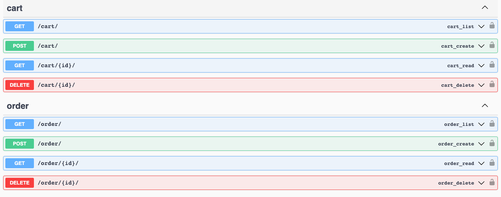

# Shelf shop API

## Description
This is a simple API for a shop with shelves. It allows to add shelves to cart and make orders.
It allows to set daily limits for regions and globally for number of order items that can be purchased in one day. 

## Requirements
- python 3.11
- docker
- docker-compose
(if you want to run without docker, you need to install postgresql and pipenv)

## Installation
Create and fill in the .env.dev file in the project root directory based on .env.dev.example.

Run the following commands in the project root directory:
```docker-compose up```

To create superuser:
```docker-compose run -rm web python manage.py createsuperuser```

Running without Docker:
Create and fill in the .env.dev file in the project root directory based on .env.dev.example.
Create database in postgresql and fill in SQL_DATABASE .env.dev (and SQL_HOST if needed e.g. localhost).

```pipenv install -r requirements.txt```
    
```pipenv shell```

```python manage.py migrate```

```python manage.py loaddata fixtures.json```

```python manage.py createsuperuser```

```python manage.py runserver```


## Running tests
In the project root directory run for docker:
```docker-compose run web pytest .```

If run without docker:
```pytest .```

## Access
API is available only for authenticated users (BasicAuth: username and password). To access the API you can use 
Swagger or Postman but credentials are required. API allows to access only carts and orders of the logged user.

To create users or browse all orders and carts please use Django admin panel.

## Limits
Limits are for number of items that can be ordered in one day. If order contains more items than the limit, it will be
rejected.
There are two types of limits:
- global - limits the number of items in all orders in the shop (no matter what's the local limit)
- local - limits the number of items in orders in a given region


## Endpoints
Access to carts and orders is limited for the logged user. To access different user carts and orders, you need to log 
in as that user.
### Carts
/api/cart/ - GET - list of carts

/api/cart/ - POST - create or update (use the same region and add shelf) a new cart (params: region id, shelf id)
```
{
  "region": 1,
  "cart_items": [
    {
      "shelf": 1
    }
  ]
}
```

/api/cart/{id}/ GET - get cart details for region (cart id)

/api/cart/{id}/ DELETE - delete cart details for region (cart id)

### Orders
/api/order/ - GET - list of orders

/api/order/ - POST - create or update (use the same region and add shelf) a new order (params: cart id, region name)
```
{
  "cart_id": 1,
  "region": "POL"
}
```
/api/order/{id}/ - GET - order details (params: order id)

/api/{id}/ DELETE - delete order (params: order id)

## Docs
For OpenAPI documentation go to DOMAIN/swagger/ (login required).



## TODO
Limit validation is done only on API level. It should be done on model level as well.

Limits are dynamic but only in limit quantity not period of validity. Combined with new fields limit_start and 
limit_end in limit models cache entry TTL based on that information would determine how long the limit is valid.

API interface should be unified e.g. Cart and Order region params should both be either region id or region name.